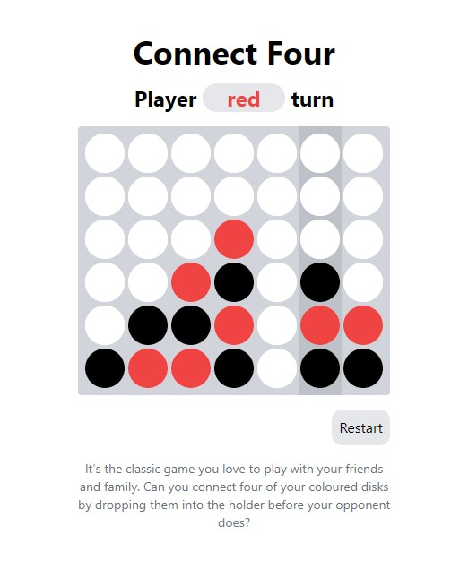

# Connect Four

This is a simple implementation of the Connect Four game using React.

The game is hosted on Vercel and can be accessed at https://connect-4-test.vercel.app

## How to run

1. Clone the repository
2. Run `yarn`
3. Run `yarn dev`
4. Visit `http://localhost:5173`

## How to play

1. The game is played on a grid that's 7 columns by 6 rows.
2. Players take turns dropping one of their colored discs from the top into a column.
3. The disc falls straight down, occupying the lowest available space within the column.
4. The objective of the game is to be the first to form a horizontal, vertical, or diagonal line of four of one's own discs.
5. The game ends when there is a winner or the board is full with no more possible moves.

## Scripts

- `yarn dev`: Start the development server
- `yarn build`: Build the project for production
- `yarn test`: Run tests using Vitest

## Technologies Used

- React for building the user interface
- TypeScript for type safety
- Redux Toolkit for state management
- Vitest for testing
- Tailwind CSS for styling

## Game Screenshot

